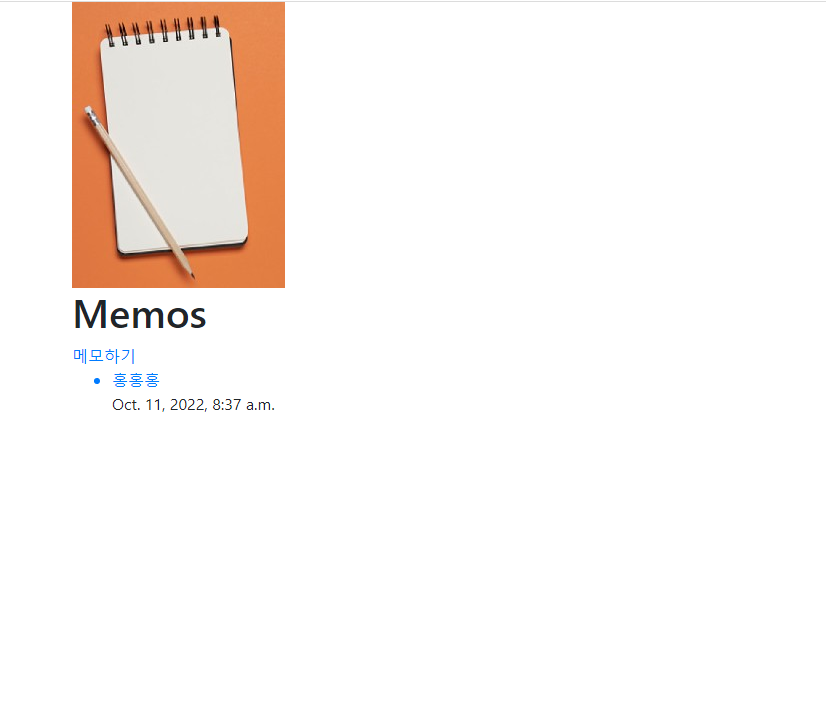
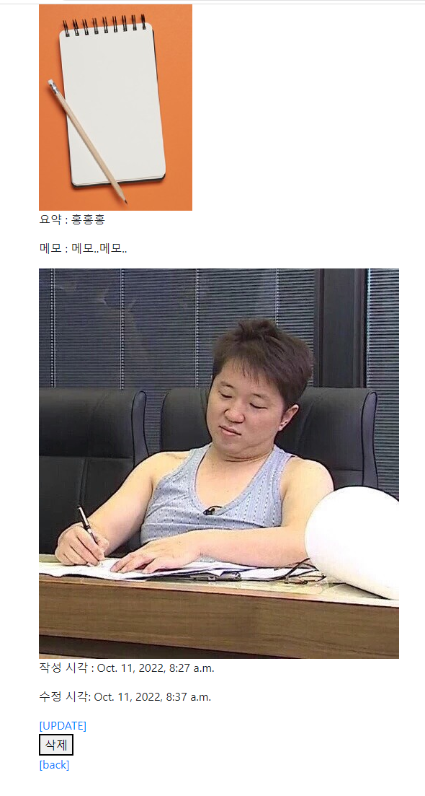

settings.py
static 이랑 media 경로 추가

```py
STATIC_URL = '/static/'

STATICFILES_DIRS = [
    BASE_DIR / 'static',
]

MEDIA_ROOT = BASE_DIR / 'media'

MEDIA_URL = '/media/'

```


urls.py
```py
from django.conf import settings
from django.conf.urls.static import static

urlpatterns=[

]+ static(settings.MEDIA_URL, document_root=settings.MEDIA_ROOT)
```

views.py
request.FILES 추가

```py
@require_http_methods(["GET","POST"])
def create(request):
    if request.method == "POST":
        form = MemoForm(request.POST, request.FILES)
        if form.is_valid():
            memo = form.save()
            return redirect("memos:detail", memo.pk)
    else:
        form = MemoForm()
    context = {
        'form' : form,
    }
    return render(request,'memos/create.html',context)


@require_http_methods(["GET","POST"])
def update(request,pk):
    memo = get_object_or_404(Memo,pk=pk)
    if request.method == "POST":
        form = MemoForm(request.POST, request.FILES, instance = memo)
        if form.is_valid:
            form.save()
            return redirect("memos:detail",memo.pk)
    else:
        form = MemoForm(instance=memo)
    context = {
        'memo':memo,
        'form':form,
    }
    return render(request,"memos/update.html",context)

```

models.py
image 테이블 추가
```py
    image = models.ImageField(blank=True, upload_to='images/')
```

create.html & update.html
enctype 추가
```py



  <h1>CREATE</h1>
  <form action="" method="POST" enctype="multipart/form-data">
    
    {{ form.as_p }}
    <input type="submit">
  </form>
  <hr>
  <a href="">[back]</a>

```

base.html
base.html에 메모장 이미지 추가
```html
    
```