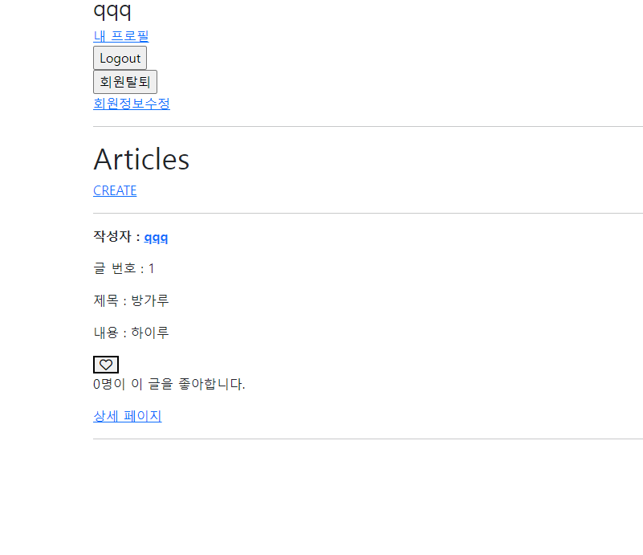

index.html
하트 넣기위해 fontawesome사용
```html
    <div>
      <form action="" method="POST">
        
        
           <input typde="submit" value="좋아요 취소"> 
          <button class="fa-solid fa-heart" type="submit"></button>
        
           <input type="submit" value="좋아요"> 
          <button class="fa-regular fa-heart" type="submit">
        

      </form>
    </div>
    <p>{{ article.like_users.all | length }}명이 이 글을 좋아합니다.</p> 
```

base.html
fontawesome 사용하기 위해 추가
```html
<script src="https://kit.fontawesome.com/fc5c6edb80.js" crossorigin="anonymous"></script>
```

views.py
views에 likes 함수 추가
```py
@require_POST
def likes(request, article_pk):
    if request.user.is_authenticated:
        article = Article.objects.get(pk=article_pk)
        if article.like_users.filter(pk=request.user.pk).exists():
            article.like_users.remove(request.user)
        else:
            article.like_users.add(request.user)
        return redirect('articles:index')
    return redirect('accounts:login')
```

urls.py
urls에 like url 추가
```py
    path('<int:article_pk>/likes/', views.likes, name='likes'),
```

models.py
models 에 테이블 추가
```py
    like_users = models.ManyToManyField(settings.AUTH_USER_MODEL,related_name='like_articles')
```





