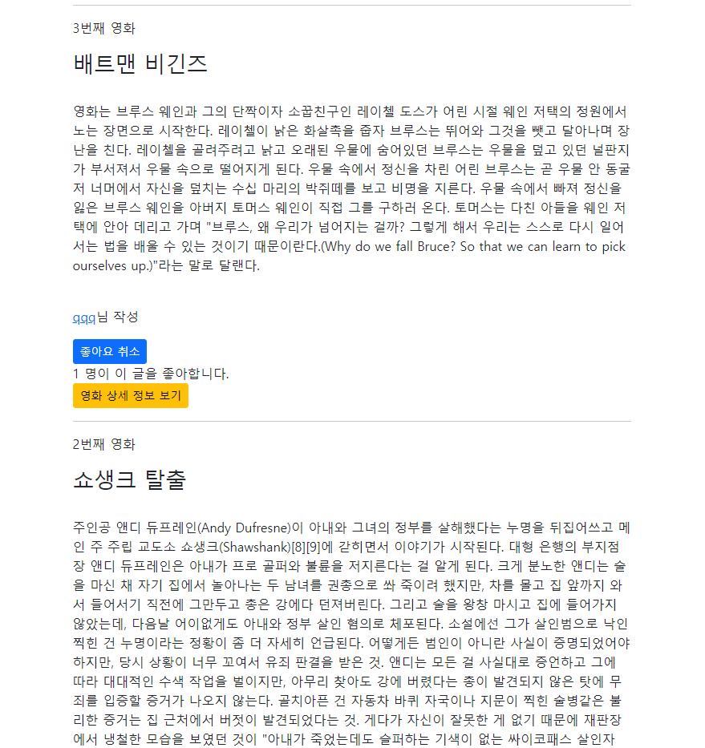
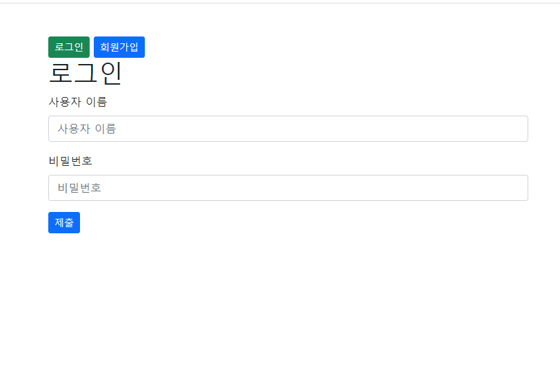

views.py
# 좋아요 
```py
@require_POST
def likes(request, movie_pk):
    if request.user.is_authenticated:
        movie = get_object_or_404(Movie, pk=movie_pk)

        if movie.like_users.filter(pk=request.user.pk).exists():
            # if request.user in movie.like_users.all():
            movie.like_users.remove(request.user)
        else:
            movie.like_users.add(request.user)
        return redirect("movies:index")
    return redirect("accounts:login")
```

models.py
# 테이블
```py
class Movie(models.Model):
    hashtags = models.ManyToManyField(Hashtag, blank=True)
    like_users = models.ManyToManyField(settings.AUTH_USER_MODEL, related_name='like_articles')
    user = models.ForeignKey(settings.AUTH_USER_MODEL, on_delete=models.CASCADE)
    title = models.CharField(max_length=10)
    content = models.TextField()
    created_at = models.DateTimeField(auto_now_add=True)
    updated_at = models.DateTimeField(auto_now=True)
```

urls.py
```py
    path("<int:movie_pk>/likes/", views.likes, name="likes"),
```

index.html
```html



  <div class="d-flex justify-content-between align-items-center">
    <h1>영화 게시판</h1>
    
      <a href="" class="btn btn-primary btn-sm">영화 정보 작성</a>
    
      <a href="" class="btn btn-success">새 영화 정보를 작성하려면 로그인하세요.</a>
    
  </div>
  <hr>
  
    <p>{{ movie.pk }}번째 영화</p>
    <h3>{{ movie.title }}</h3>
    <br>
    <p>{{ movie.content }}</p>
    <br>
    <p>
      <a href="">{{ movie.user }}</a>님 작성
    </p>
    <div>
      <form action="" method="post">
        
        
          <input type="submit" value="좋아요 취소" class="btn btn-primary btn-sm">
        
          <input type="submit" value="좋아요" class="btn btn-primary btn-sm">
        
      </form>
		  <span>{{ movie.like_users.all|length }} 명이 이 글을 좋아합니다.</span>
    </div>
    <a href="" class="btn btn-warning btn-sm">영화 상세 정보 보기</a>
    <hr>
  

```





