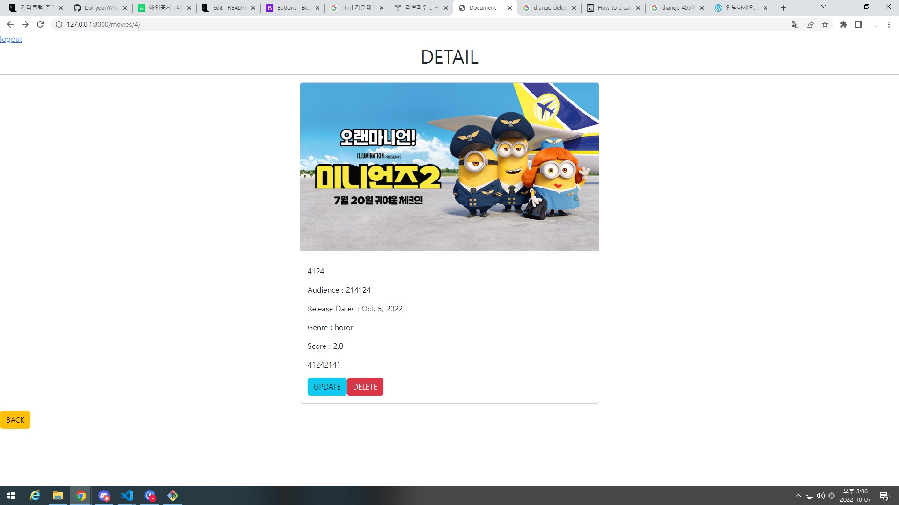

# 05_pjt


```
  <button class="btn btn-danger" type="reset">CANCEL</button>
```
- 캔슬버튼을 만드는게 기억이 안났다. 질문해서 알아내고 찾아보니 다시 기억이 났다. 


```
    score = forms.FloatField(
        widget=forms.NumberInput(
                        attrs={
                'min': 0, 'max': 5, 'step' : 0.5, 
                'placeholder' : 'Score'
                }
            ),
        )
```
- 위젯을 사용하는걸 천만년만에 해서 많이 찾아 봤다. 스택오버플로우는 보면 볼 수록 영어공부의 필요성을 느낀다. 
숫자를 입력하는곳에 최대치와 최소치 그리고 오른쪽 딸깍딸깍의 한 번당 오르는 수치를 정하는 방법을 배웠다.


```
    genre = forms.ChoiceField(
        widget = forms.Select(),
        choices = ([('comedy','comedy'), ('horor', 'horor'), 
                    ('romance', 'romance')]), 
        required = True,

    )
```
- 어제 사용한 choices이다 어제는 블룸필드였지만 이번엔 보기가 여러개라서 좀 변형해 보았다.

```
        
        <div class="d-flex justify-content-start">
          <a class="btn btn-info" href="" role="button">UPDATE</a>
          
          <form action="" method="POST">
            
            <button class="btn btn-danger" >DELETE</button>
          </form>
        </div>
        
```
- 딜리트를 만들어보는데 많은 시행착오가 있었다. 문제는 딜리트 문자를 button으로 안감싸줘서 보내지지가 않았다.


총정리 : 전반적으로 오래 걸리지 않았다. 이쁘게 만들지 않아서 기능만 하게끔 만들어서 좀 허접하다...
        모델과 모델폼은 매번 해보면 이해가 되는데 좀만 시간이 지나면 바로 까먹어 버린다. 
        이전에 한 코드를 안보고 내 손으로 작성하면 매번 하나씩 빼먹는것이 있거나 오타가 자주 보인다. 
        



