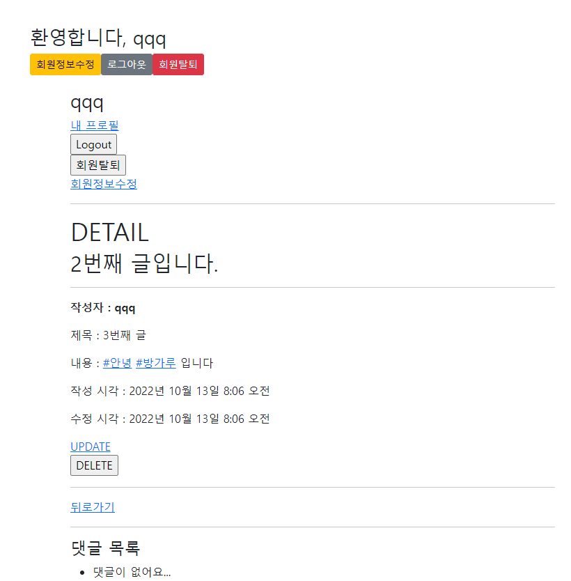
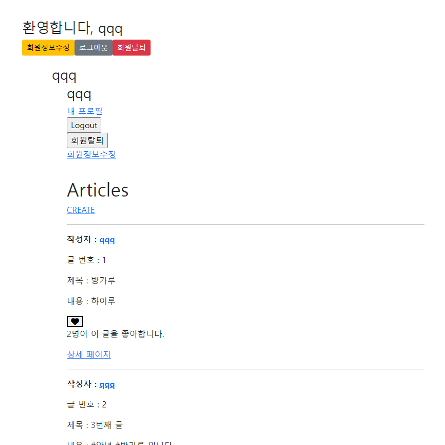

views.py
```py
@login_required
@require_http_methods(['GET', 'POST'])
def create(request):
    if request.method == 'POST':
        form = ArticleForm(request.POST)
        if form.is_valid():
            article = form.save(commit=False)
            article.user = request.user
            article.save()
            for word in article.content.split():
                if word.startswith('#') :
                    hashtag, created = Hashtag.objects.get_or_create(content=word)
                    article.hashtags.add(hashtag)
            return redirect('articles:detail', article.pk)
    else:
        form = ArticleForm()
    context = {
        'form': form,
    }
    return render(request, 'articles/create.html', context)

def hashtag(request, hash_pk) :
    hashtag = get_object_or_404(Hashtag, pk=hash_pk)
    context = {
        'hashtag' : hashtag,
    }

    return render(request, 'articles/hashtag.html', context)
```

urls.py
```py
    path('<int:hash_pk>/hashtag/', views.hashtag, name='hashtag')
```

models.py
```py
class Article(models.Model):
    hashtags = models.ManyToManyField(Hashtag, blank=True)

class Hashtag(models.Model):
    content = models.TextField(unique=True)
```


make_link.py
```py
from django import template

register = template.Library()

@register.filter
def hashtag_check(article) :
    content = article.content
    hashtags = article.hashtags.all()

    for hashtag in hashtags :
        content = content.replace(hashtag.content, f'<a href="/articles/{hashtag.pk}/hashtag/">{hashtag.content}</a>')
    return content
```

hashtag.html
```html



  <h1>{{ hashtag.content }}</h1>
  {{ hashtag.article_set_all | length }}개의 게시글
  <hr>
  <div>
    <h1>{{ hashtag.content }}(을)를 태그한 글</h1>
    
      <h2>{{ article.pk }}번 게시글</h2>
      <h2>{{ article.title }}</h2>
      <p>{{ article.comment_set.all | length }}개의 댓글</p>
      <a href="">상세글로 바로 가기</a>
      <hr>
    
  </div>

```




