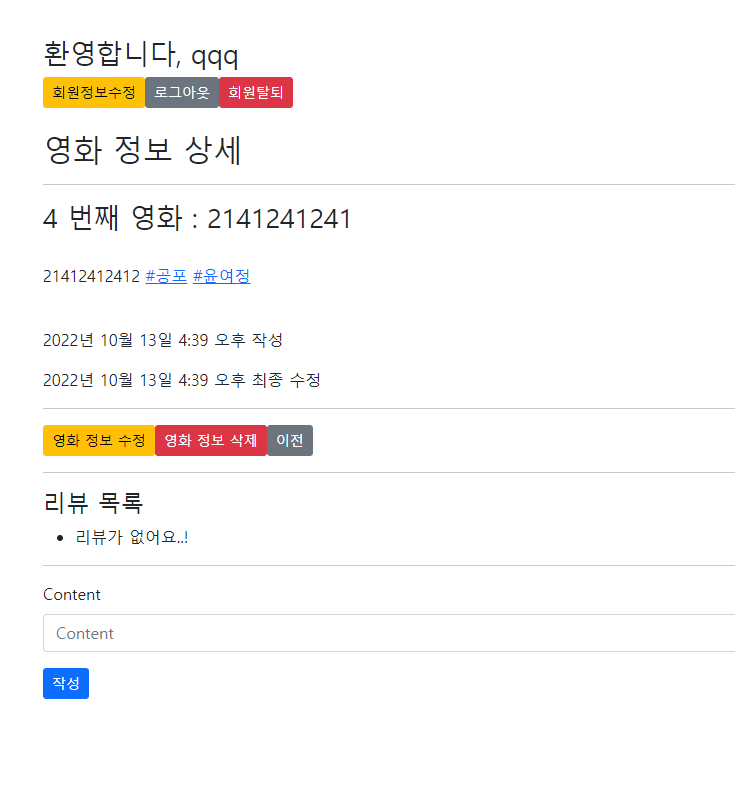
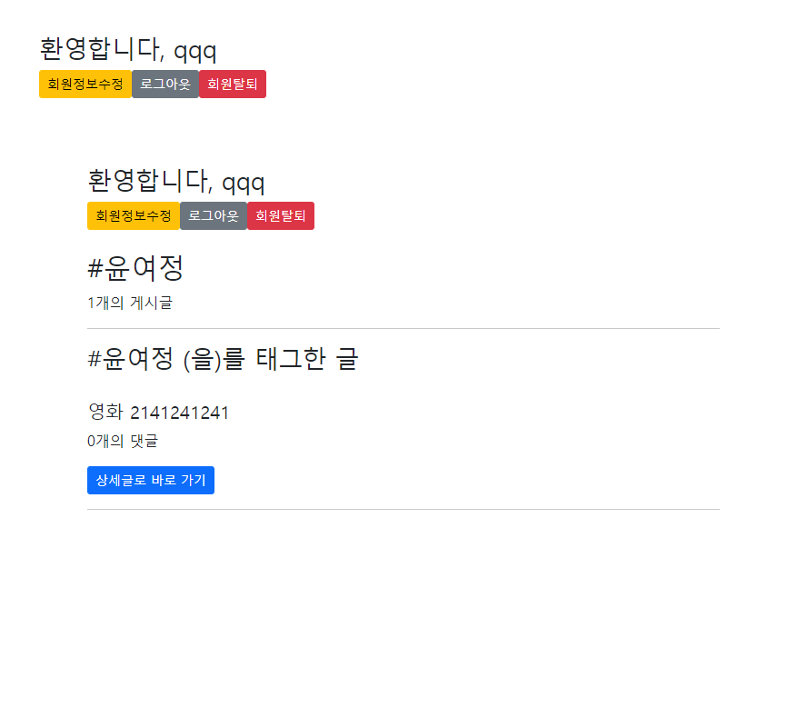

hashtag.html
```html



  <div>
    <h2>{{ hashtag.content }}</h2>
    <p>{{ movies|length }}개의 게시글</p>
  </div>
  
  <hr>

  <div>
    <h3>{{ hashtag.content }} (을)를 태그한 글</h3>
    <br>
    
      <h5>영화 {{ movie.title }}</h5>
      <p>{{ movie.comment_set.all|length }}개의 댓글</p>
      <a href="" class="btn btn-primary btn-sm">상세글로 바로 가기</a>
      <hr>
    
  </div>

```

views.py
```py
@login_required
def hashtag(request, hash_pk):
    hashtag = get_object_or_404(Hashtag, pk=hash_pk)
    movies = hashtag.movie_set.order_by('-pk')
    context = {
        'hashtag': hashtag, 
        'movies': movies,
    }
    return render(request, 'movies/hashtag.html', context)

@login_required
@require_http_methods(['GET', 'POST'])
def create(request):
    if request.method == 'POST':
        form = MovieForm(request.POST)
        if form.is_valid():
            movie = form.save(commit=False)
            movie.user = request.user
            movie.save()
            for word in movie.content.split():
                if word.startswith('#'):
                   hashtag, created = Hashtag.objects.get_or_create(content=word)
                   movie.hashtags.add(hashtag)
            return redirect('movies:detail', movie.pk)
    else:
        form = MovieForm()
    context = {
        'form': form,
    }
    return render(request, 'movies/create.html', context)
```

models.py
```py
class Movie(models.Model):
    hashtags = models.ManyToManyField(Hashtag, blank=True)


class Hashtag(models.Model):
    content = models.TextField(unique=True)

```

make_link.py
```py
from django import template

register = template.Library()

@register.filter 
def hashtag_link(word):
    content = word.content + ' '
    hashtags = word.hashtags.all()
    for hashtag in hashtags:
        content = content.replace(hashtag.content + ' ', f'<a href="/movies/{hashtag.pk}/hashtag/">{hashtag.content}</a> ')
    return content
```



