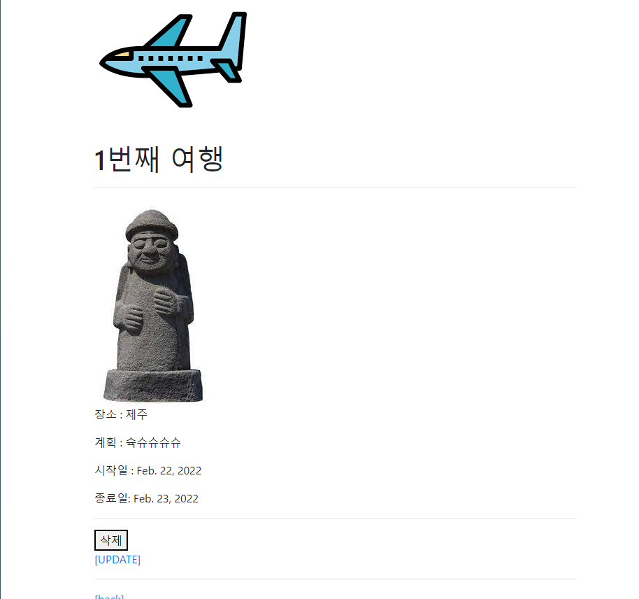

detail.html
```html



  <h1>{{ memo.pk }}번째 여행</h1>
  <hr>
  
  
  
  <p>장소 : {{ memo.location  }}</p>
  <p>계획 : {{ memo.plan  }} </p>
  <p>시작일 : {{ memo.start_date  }} </p>
  <p>종료일: {{ memo.end_date  }} </p>

  <hr>
  <form action=" " method="POST">
    
    <button>삭제</button>  
  </form>
  <a href="">[UPDATE]</a>
  <hr>
  <a href="">[back]</a>

```

models.py
```py

from django.db import models
from django.conf import settings
from imagekit.processors import Thumbnail
from imagekit.models import ProcessedImageField, ImageSpecField

# Create your models here.
class Travel(models.Model):
    location = models.CharField(max_length=10)
    plan = models.TextField()
    start_date = models.DateField()
    end_date = models.DateField()
    image = models.ImageField(blank=True)
    image_thumbnail = ImageSpecField(
        source='image',
        processors=[Thumbnail(100,100)],
        format='JPEG',
        options={'quality': 90},
    )
```

forms.py
```py
# Create your models here.

from django import forms
from .models import Travel


class TravelForm(forms.ModelForm):
    location = forms.CharField(
        label='Location',
        widget=forms.TextInput(
            attrs={
                'class': 'my-location',
                'placeholder': 'ex) 제주도',
                'maxlength': 10,
            }
        )
    )

    plan = forms.CharField(
        label='plan',
        widget=forms.Textarea(
            attrs={
                'class': 'my-plan',
                'placeholder': 'ex) 슉.슈슉.슉',
                'rows': 5,
                'cols': 50,
            }
        ),
        error_messages={
            'required': '내용을 입력하세요.',
        }
    )
    start_date = forms.DateField(
        label='start date',
        widget=forms.TextInput(
            attrs={
                'class': 'my-start_date',
                'placeholder': 'ex) 2022-02-22',

            }
        ),
        error_messages={
            'required': '내용을 입력하세요.',
        }
    )
    end_date = forms.DateField(
        label='end date',
        widget=forms.TextInput(
            attrs={
                'class': 'my-end_date',
                'placeholder': 'ex) 2022-02-22',

            }
        ),
        error_messages={
            'required': '내용을 입력하세요.',
        }
    )
    class Meta:
        model = Travel
        fields = '__all__'
        # exclude = ('title',)
```

base.html
```html
  <div class="container">
    
    

    
    
  </div>
```

urls.py
```py

from django.urls import path
from . import views
from django.conf import settings
from django.conf.urls.static import static

app_name="memos"
urlpatterns = [
    path('',views.index,name="index"),
    path('create/',views.create,name='create'),
    path('<int:pk>/',views.detail,name='detail'),
    path('<int:pk>/delete',views.delete,name='delete'),
    path('<int:pk>/update',views.update,name='update'),

] + static(settings.MEDIA_URL, document_root=settings.MEDIA_ROOT)
```





