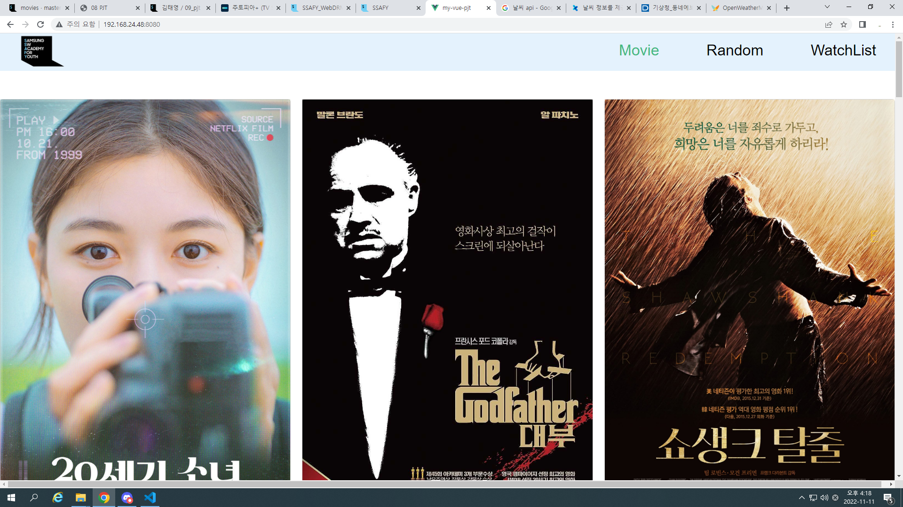

# my-vue-pjt

# 09_pjt

김태영 여도현 09_pjt

### 여도현

watch 부분의 기능 구현과 css, vuex의 index.js의 초안과 영화 api를 가져와서 출력하는걸 작성

영화의 api는 TMDB에서 가져왔고 vuex를 활용해 axios로 받아서 활용하였습니다.
watch 부분은 이전의 todolist와 유사하게 v-model을 활용하여 작성하고 큰 틀은 bootstrap의 카드를 가져와서 작성하였습니다.
또 random페이지를 첫 랜더링 했을때 하나의 랜덤 영화가 출력되게끔 created를 활용하여 작성했습니다.

### 김태영

RandomView 작성 및 navbar 작성
Math.random 메서드를 이용하여서 영화 중에서 하나를 골라서 보여주었다.
navbar에는 router 링크들이 있으며
상단에 고정 시켜놓기 위해서 position : fixed 를 해두었다.
딱히 어려운 기능은 없어서 간단했다.
추후에 디테일 페이지를 router 로 구현해 보아야 겠다.

## image
### 무비화면

### 랜덤화면

### watch화면


## Project setup
```
npm install
```

### Compiles and hot-reloads for development
```
npm run serve
```

### Compiles and minifies for production
```
npm run build
```

### Lints and fixes files
```
npm run lint
```

### Customize configuration
See [Configuration Reference](https://cli.vuejs.org/config/).
